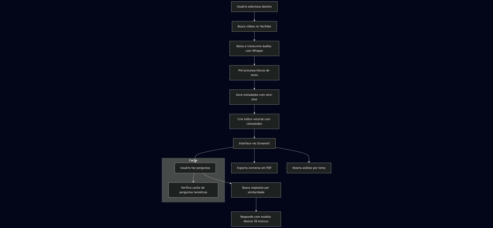

# AI Trip Guide - Explorador de Viagens com IA

Projeto de portfólio que utiliza LLMs open-source para processar, classificar e responder perguntas com base em vídeos reais do YouTube sobre o Chile.


## 🎯 Objetivo

Demonstrar habilidades em engenharia de dados, NLP e uso de modelos de linguagem de código aberto para construir uma aplicação interativa de apoio ao planejamento de viagens.

## 🧱 Arquitetura


## 🔍 Funcionalidades

- 🔎 Busca automática de vídeos no YouTube com base no destino informado.
- 📥 Download e transcrição de áudio com Whisper.
- ✂️ Divisão inteligente de blocos de texto.
- 🧠 Classificação temática com modelo zero-shot.
- 🗃️ Indexação com LlamaIndex + embeddings locais.
- 💬 Interface interativa com Streamlit para perguntas e respostas baseadas nos vídeos.
- 📊 Painel de análise com estatísticas dos temas detectados.
- 📁 Exportação da conversa em PDF.
- ⚡ Cache local de respostas para evitar reprocessamento.

## 🧠 Modelos Utilizados

- **Transcrição**: `openai/whisper-medium` (via `whisper`)
- **Classificação de temas**: `facebook/bart-large-mnli`
- **Geração de respostas**: `mistralai/Mistral-7B-Instruct-v0.2` (quantizado com `bitsandbytes`)
- **Embeddings**: `sentence-transformers/paraphrase-multilingual-MiniLM-L12-v2`

## 🖼️ Exemplo de Uso

Veja abaixo como o projeto funciona na prática:

### 🔍 1. Escolha de tema e pergunta
O usuário seleciona um tema ou digita uma pergunta personalizada com base nos vídeos sobre o Chile.


---

### 🤖 2. Resposta da IA baseada nos vídeos analisados
A resposta é gerada com base nas transcrições dos vídeos, filtrada por tema e exibida de forma clara.


---

### 📊 3. Visualização analítica dos dados
Gráficos e estatísticas ajudam a visualizar os temas mais frequentes nos vídeos processados.


## 🚀 Como Executar Localmente

1. Clone este repositório
2. Instale as dependências:
```bash
pip install -r requirements.txt
```
3. Adicione um arquivo `.env` com sua chave da API do YouTube:
```env
YOUTUBE_API_KEY=sua_chave_aqui
```
4. Execute o app:
```bash
streamlit run app.py
```

## 📁 Estrutura do Projeto

```
├── app.py
├── src/
│   ├── mistral_llm.py
│   ├── utils.py
│   ├── paginas/
│   │   ├── home.py
│   │   ├── analise.py
│   ├── vectordatabase/
│   ├── transcriptions/
│   ├── cache/
│   │   └── respostas_cache.py
├── requirements.txt
└── .env
```

## ✍️ Autor

**Rafael Gardel** - [LinkedIn](https://www.linkedin.com/in/rafael-gardel-b1976999/)

---

📌 Projeto educacional e de demonstração para portfólio. Nenhum conteúdo de vídeo foi redistribuído.
