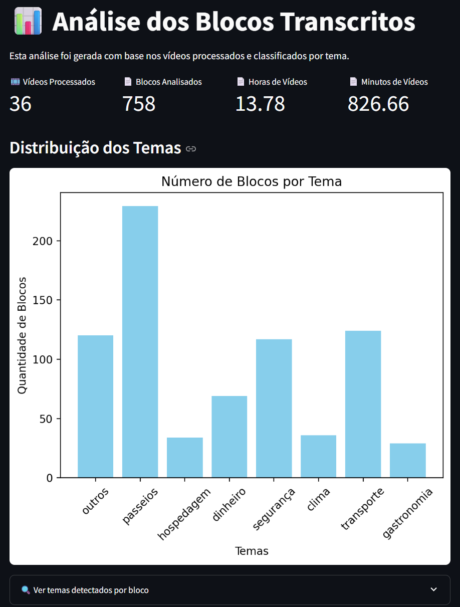

# AI Trip Guide - Explorador de Viagens com IA

Projeto de portfólio que utiliza **LLMs open-source** para processar transcrições de vídeos reais do YouTube sobre destinos de viagem e gerar respostas úteis para o planejamento de roteiros.


---

## 🎯 Objetivo
Criar uma aplicação prática que aproveite **Modelos de Linguagem de Código Aberto** para organizar, resumir e explorar informações de viagens, inspirada na minha própria experiência planejando uma viagem ao Chile (Santiago e regiões de neve). O projeto combina:

- IA generativa para responder com base no contexto dos vídeos.
- Engenharia de dados para processar e estruturar informações de vídeos e textos.
- NLP (Processamento de Linguagem Natural) para gerar resumos, classificar temas e responder perguntas sobre o destino.
- Interfaces interativas com Streamlit, permitindo uma exploração intuitiva e dinâmica do conteúdo de viagem.

---

## 🧱 Arquitetura do Projeto
Para compreender a arquitetura do projeto, é necessário primeiramente entender que ele possui tanto modo local como modo cloud.

Modo local: Roda no próprio computador do usuário e necessita de uma placa de vídeo com ao menos 8GB. 

Modo cloud: Roda sem depender de recursos locais, utilizando o Gemini como um agente que responde as perguntas do  usuário, baseando-se no conteúdo dos vídeos.

### Arquitetura do Projeto no modo Cloud

[Diagrama de fluxo do projeto modo Cloud](src/images/diagram_pt_cloud.png)

Fluxo resumido:
1. Busca de vídeos no YouTubeAPI por destino.
2. Extração, transcrição e resumo via **Gemini**.
3. Classificação de blocos por tema.
5. Criação de índice vetorial local com **LlamaIndex**.
6. Usuário faz perguntas sobre o local
7. Tema da pergunta é identificado **Gemini 2.5 flash**.
8. Contexto é filtrado do vectordatabase **LlamaIndex**.
6. Respostas dinâmicas com o modelo **Gemini 2.5 flash**.

### Arquitetura do Projeto no modo Local

[Diagrama de fluxo do projeto modo Local](src/images/diagram_pt_local.png)

Fluxo resumido:
1. Busca de vídeos no YouTube por destino.
2. Extração e transcrição de áudio via **Whisper**.
3. Pré-processamento e segmentação de texto.
4. Classificação de blocos por tema.
5. Criação de índice vetorial local com **LlamaIndex**.
6. Respostas dinâmicas com o modelo **Mistral**.

---

## 🔍 Funcionalidades
Modo Cloud:
Uma das maiores vantagens do projeto é a possibilidade de rodar em **modo cloud**, sem depender de GPUs locais.  
Nesse modo, o motor de geração de respostas não é o **Mistral local**, mas sim a **Gemini API (Google AI)**.

### 🔑 Como funciona
1. As transcrições de vídeos continuam sendo processadas e indexadas com **LlamaIndex**.
2. O índice pode ser armazenado no Localmente ou no **S3** (ou outro storage remoto), evitando reprocessar a cada execução.
3. Quando o usuário faz uma pergunta, o app envia o **contexto relevante do índice** para a **Gemini API**.
4. A Gemini gera a resposta baseada no contexto enviado e retorna para a interface Streamlit.

### 🌍 Benefícios do modo Cloud
- **Escalabilidade** → não depende da GPU local, roda em qualquer instância cloud.
- **Menor custo de infra** → usa apenas API calls (de graça  até 60 requisições por segundo).
- **Integração simples** → basta configurar a variável `GEMINI_API_KEY` no `.env` ou nas secrets do Streamlit Cloud.
- **Mesma interface** → o usuário final não percebe diferença: as respostas são geradas da mesma forma.

- 🔎 Busca automática de vídeos do YouTube a partir de um destino informado.
- 🎙️ Transcrição e resumo usando o GeminiAPI.
- 🧠 Classificação temática automática.
- 🗃️ Indexação vetorial com **LlamaIndex** e embeddings locais.
- 🤖 Geração de respostas contextualizadas com **Gemini 2.5 flash**.
- 📊 Painel de análise de temas mais recorrentes.
- 📁 Exportação das conversas em PDF.
- ⚡ Cache local de respostas para acelerar reconsultas.

### ⚙️ Configuração
No `.env` adicione:
- YOUTUBE_API_KEY=sua_chave_youtube
- GEMINI_API_KEY=sua_chave_gemini

Modo Local:
- 🔎 Busca automática de vídeos do YouTube a partir de um destino informado.
- 🎙️ Transcrição do áudio com Whisper.
- ✂️ Divisão inteligente de blocos de texto.
- 🧠 Classificação temática automática.
- 🗃️ Indexação vetorial com **LlamaIndex** e embeddings locais.
- 🤖 Geração de respostas contextualizadas com **Mistral 7B Instruct**.
- 📊 Painel de análise de temas mais recorrentes.
- 📁 Exportação das conversas em PDF.
- ⚡ Cache local de respostas para acelerar reconsultas.

---

## 🧠 Modelos Utilizados

No modo Cloud:
- **Transcrição**: [`Gemini/Gemini 2.5 Flash`](https://gemini.google.com/)
- **Classificação de temas**: [`Gemini/Gemini 2.5 Flash`](https://gemini.google.com/)
- **Geração de respostas**: [`Gemini/Gemini 2.5 Flash`](https://gemini.google.com/)
- **Embeddings**: [`gemini-embedding-001`](https://ai.google.dev/gemini-api/docs/embeddings?hl=pt-br)


No modo Local:
- **Transcrição**: [`openai/whisper-medium`](https://github.com/openai/whisper)
- **Classificação de temas**: [`facebook/bart-large-mnli`](https://huggingface.co/facebook/bart-large-mnli)
- **Geração de respostas**: [`mistralai/Mistral-7B-Instruct-v0.2`](https://huggingface.co/mistralai/Mistral-7B-Instruct-v0.2) (carregado via Hugging Face Transformers, com suporte a GPU e quantização `bitsandbytes`)
- **Embeddings**: [`sentence-transformers/paraphrase-multilingual-MiniLM-L12-v2`](https://huggingface.co/sentence-transformers/paraphrase-multilingual-MiniLM-L12-v2)

---

## 📖 Detalhe: `mistral_llm.py`

Este módulo encapsula a lógica para:
- Carregar o modelo **Gemini 2.5 Flash** caso use o modo 'cloud'.
- Carregar o modelo **Mistral 7B Instruct** caso use o modo 'local'.
- Configurar aceleração por GPU (CUDA) quando disponível.
- Definir parâmetros de geração de texto (temperatura, top_p, repetição etc.).
- Criar a função `gerar_resposta(prompt)` que recebe um prompt e retorna a resposta do modelo.

Ou seja, é o coração da etapa de **perguntas e respostas** do projeto.

---

## 🖼️ Exemplo de Uso

### Link para testar o projeto
Você pode testar o projeto diretamente pelo streamlitcloud clicando no link abaixo
- **Link da Aplicação**: [`AI Trip Guide`](https://ai-trip-guide-8t4ghrfpjlc6e9gxhmk7lw.streamlit.app/)

---

### 🔍 1. Usuário escolhe um destino e faz uma pergunta


### 🤖 2. Resposta contextualizada com base nos vídeos analisados


### 📊 3. Visualização analítica dos dados processados


---

## 🚀 Como Executar Localmente

1. Clone este repositório:
```bash
git clone https://github.com/seuusuario/ai-trip-guide.git
cd ai-trip-guide
