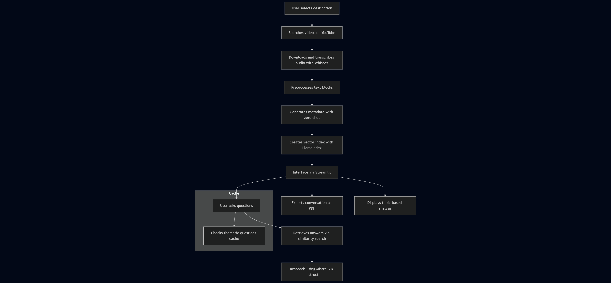
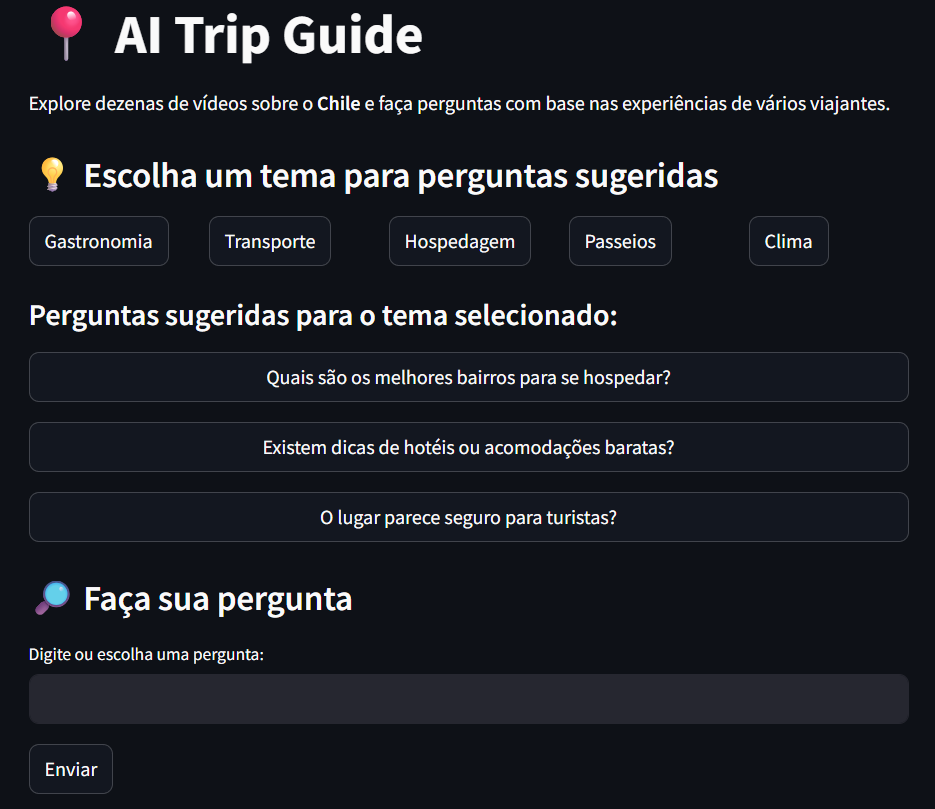
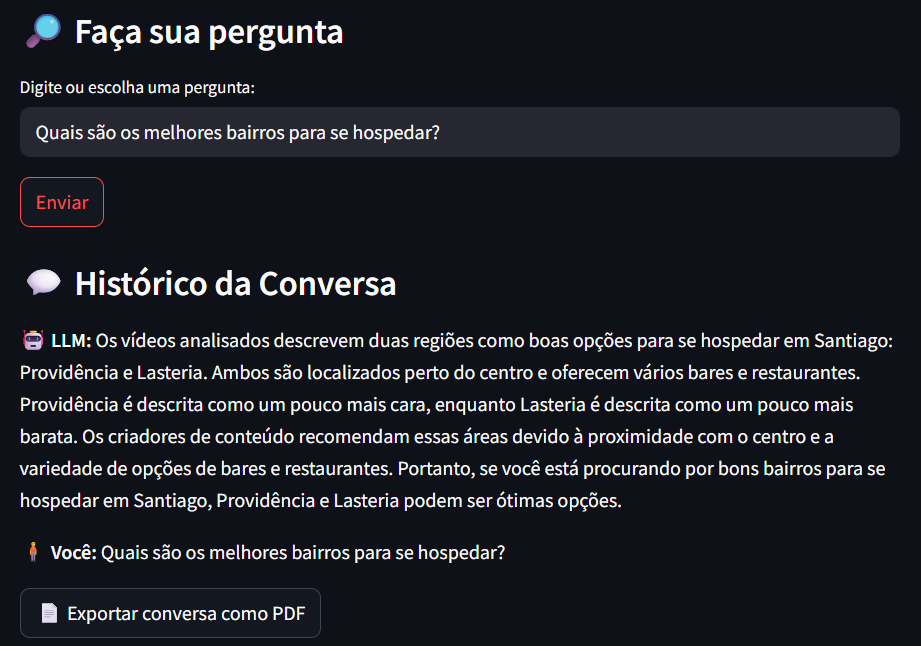
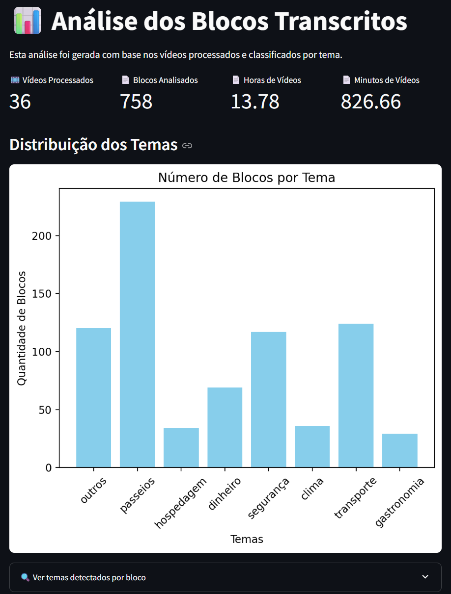

# 📍 AI Trip Guide

A smart assistant that summarizes insights from dozens of travel videos and helps you plan your trip to **Chile**.


---

## ✨ About the Project

**AI Trip Guide** uses transcriptions from real travel videos to answer questions about tourism in Chile. It organizes blocks of content by theme (e.g., food, safety, transport) and allows you to explore insights from multiple creators through a conversational interface.

All processing is done **locally**, using **open-source LLMs** and tools like:

- 🧠 **Mistral 7B Instruct** for answering questions
- 🔍 **Sentence Transformers** for semantic search
- 🧾 **Whisper** for audio transcription
- 🔎 **Zero-shot classification** for thematic labeling

---

## 💡 Features

- 🧠 Ask travel-related questions to a local LLM
- 🎞️ Automatically download and transcribe videos from YouTube
- 🗂️ Organize and filter by themes (e.g., food, transport)
- 📊 See analysis dashboards with charts and stats
- 📄 Export the conversation to PDF
- 🔁 Cache responses for faster repeated queries

---
## 🧱 Architecture

---

## 🧰 Tech Stack

| Category         | Tools/Models                                |
|------------------|----------------------------------------------|
| LLM              | `Mistral-7B-Instruct-v0.2` (via HuggingFace) |
| Embeddings       | `paraphrase-multilingual-MiniLM-L12-v2`      |
| Classification   | `facebook/bart-large-mnli`                   |
| Transcription    | `Whisper (medium)`                           |
| Frontend         | `Streamlit`                                  |
| Indexing/Search  | `LlamaIndex`                                 |
| Others           | `yt-dlp`, `python-dotenv`, `matplotlib`      |

---

## 🚀 How to Run

1. **Clone this repository**  
```bash
git clone https://github.com/seu-usuario/my-ai-guide.git
cd my-ai-guide
```

2. **Install dependencies**  
```bash
pip install -r requirements.txt
```

3. **Configure environment**  
Create a `.env` file in the root with your YouTube API key:
```
YOUTUBE_API_KEY=your_key_here
```

4. **Launch the app**  
```bash
streamlit run app.py
```

---

## 📁 Project Structure

```
├── app.py                      # Streamlit interface
├── src/
│   ├── mistral_llm.py          # LLM logic, embeddings and indexing
│   ├── utils.py                # PDF export and helpers
│   ├── themes.py               # Suggested questions by topic
│   ├── paginas/
│   │   ├── home.py             # Main interface
│   │   ├── analise.py          # Dashboards and analytics
│   ├── vectordatabase/         # Saved index
│   ├── transcriptions/         # Audio + transcription
│   ├── cache/
│   │   ├── respostas_cache.py  # Cache for LLM answers
├── .env
├── requirements.txt
├── README.md
```

---

## 🖼️ Example of Use

See below how the project works in practice:

### 🔍 1. Topic selection and question input  
The user selects a topic or types a custom question based on the videos about Chile.



---

### 🤖 2. AI-generated response based on analyzed videos  
The response is generated based on the video transcripts, filtered by topic, and displayed clearly.



---

### 📊 3. Analytical data visualization  
Charts and statistics help visualize the most frequent topics found in the processed videos.




---

## 📌 Next Steps

- Support for other destinations (Argentina, Peru, etc.)
- Add voice-based questions
- Fine-tune a custom model with real travel corpora

---

## 📜 License

MIT License.  
Feel free to fork and expand the project!

---
## ✍️ Autor

**Rafael Gardel** - [LinkedIn](https://www.linkedin.com/in/rafael-gardel-b1976999/)

---
## 🤝 Contributing

Pull requests and suggestions are welcome!  
Let’s build smarter travel tools together.